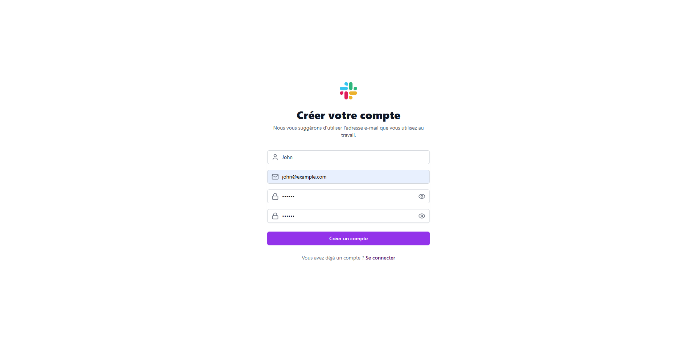
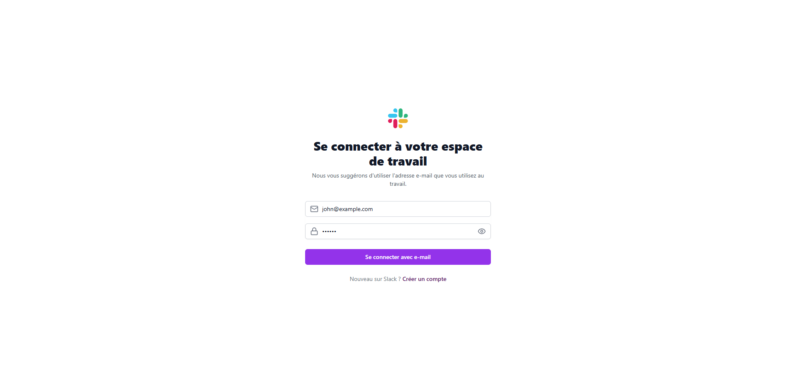
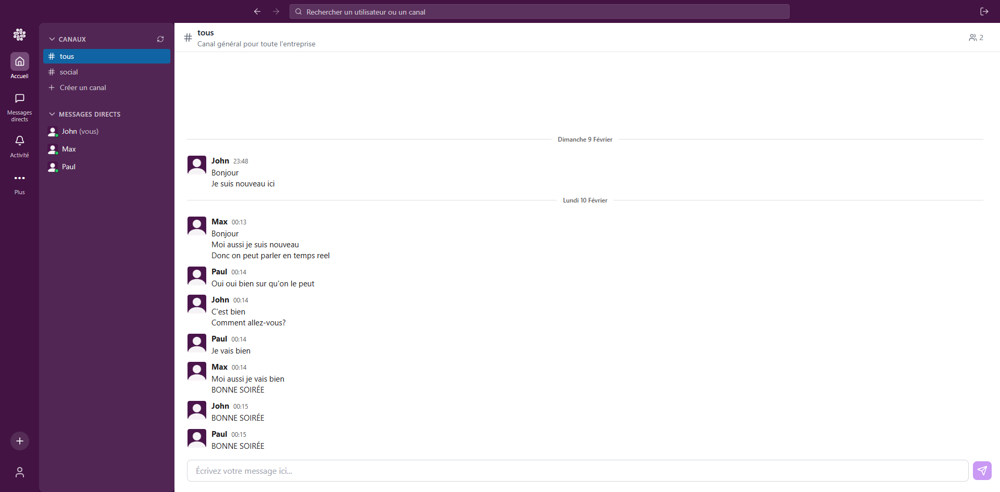
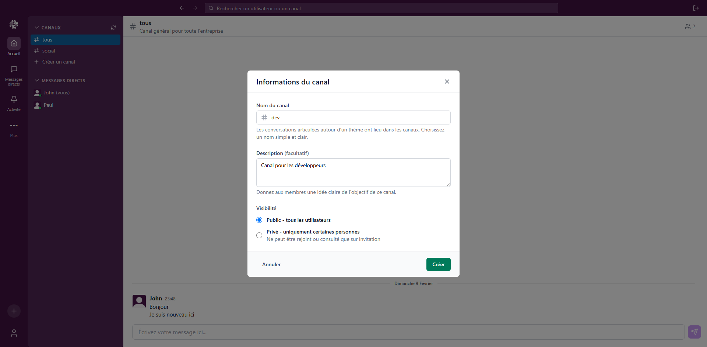
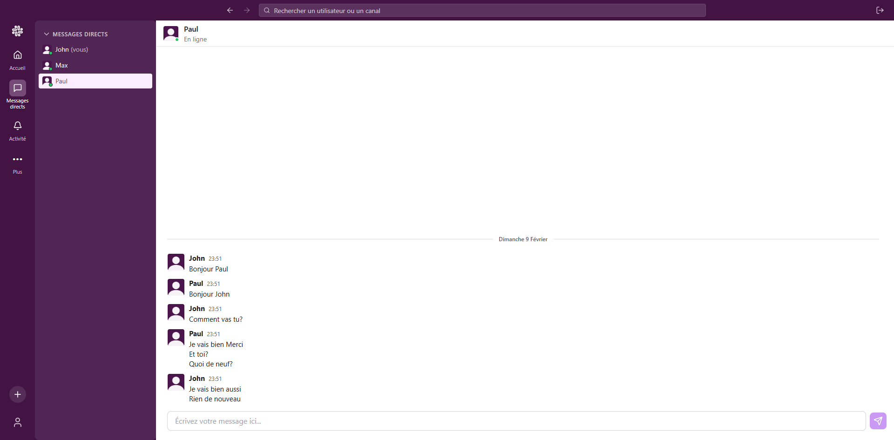
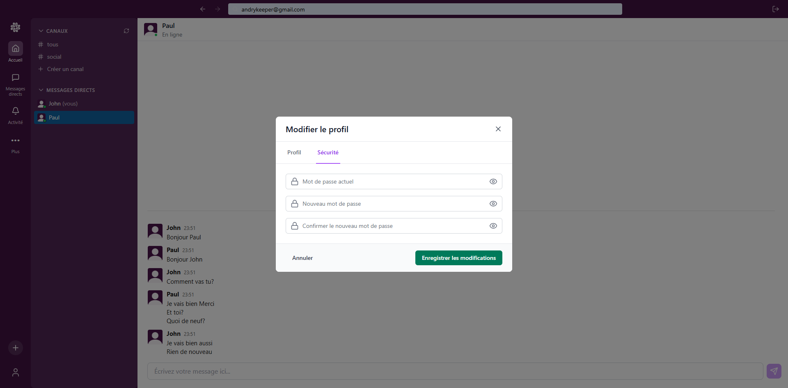
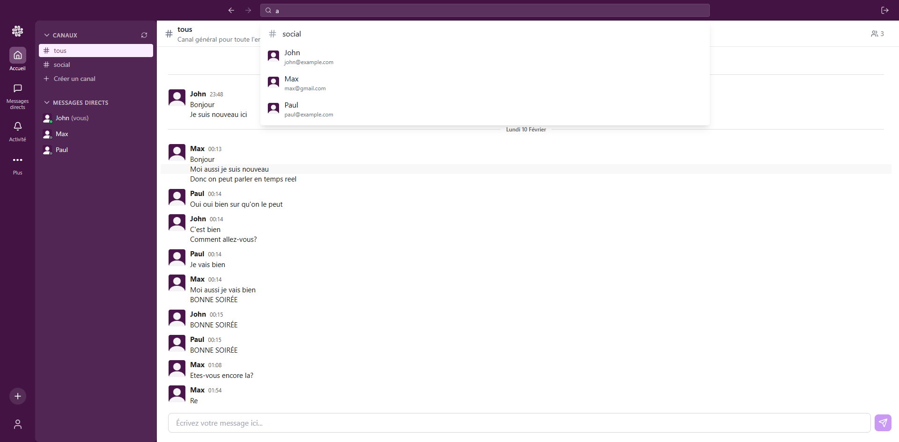

# Slack Clone

Une application de messagerie en temps réel inspirée de Slack, construite avec React (Vite), Node.js (NestJS) et MongoDB.

## 🚀 Démarrage rapide

> **Prérequis** :
> - Node.js 18+ ([Télécharger](https://nodejs.org/))
> - MongoDB ([Télécharger](https://www.mongodb.com/try/download/community) ou [Instructions d'installation](database/README.md))
> - npm ou yarn
> - Git ([Télécharger](https://git-scm.com/downloads))

### Installation

1. **Cloner le projet**
   ```bash
   git clone https://github.com/andryniaina/slack-clone.git
   cd slack-clone
   ```

### Lancement

1. **Backend**
   ```bash
   cd backend
   npm install
   npm run start     # Un log affichant le port et l'url du serveur sera affiché dans la console quand le serveur sera lancé
   ```

2. **Frontend**
   ```bash
   cd frontend
   npm install
   npm run dev          # Lance l'application sur http://localhost:5173
   ```

Ces commandes utilisent les configurations par défaut :
- Backend : `http://localhost:3000` avec MongoDB sur `mongodb://localhost:27017/slack`
- Frontend : `http://localhost:5173` connecté au backend par défaut

## ⚙️ Configuration détaillée

### Backend
- Port par défaut : `3000`
- Base de données : `mongodb://localhost:27017/slack`
- Variables d'environnement (optionnelles) :
  ```bash
  cd backend
  cp .env.example .env    # À configurer selon les besoins
  ```
  Valeurs par défaut :
  - PORT=3000
  - DATABASE_URL=mongodb://localhost:27017/slack
  - JWT_SECRET=dev-secret-key
  - JWT_EXPIRES_IN=24h

### Frontend
- Port par défaut : `5173`
- Configuration du Backend : `src/config/api.ts`
  - `BASE_URL` par défaut : `http://localhost:3000`

### Installation MongoDB
Si MongoDB n'est pas installé sur la machine, les instructions sont disponibles dans le dossier [database/](database/README.md).
Il est possible d'utiliser Docker ou une installation locale.

## 📁 Structure du Projet

```
slack/
├── backend/    # API NestJS
├── frontend/   # Application React
├── database/   # Configuration MongoDB
├── docs/       # Fichiers nécessaires pour la documentation
```


## 📱 Utilisation de l'application

### 1. Création de compte


Pour créer un compte, il suffit de remplir le formulaire d'inscription avec :
- **Nom d'utilisateur** : Le pseudo qui sera visible par les autres utilisateurs
- **Email** : Une adresse email valide (pas de vérification requise)
- **Mot de passe** : Minimum 6 caractères

> Note : Pour simplifier le développement, la vérification d'email n'a pas été implémentée pour éviter la configuration d'un serveur SMTP.

### 2. Connexion


La connexion se fait avec :
- **Email** : L'adresse email utilisée lors de l'inscription
- **Mot de passe** : Le mot de passe choisi

### 3. Dashboard


Une fois connecté, le dashboard comprend :

**Navigation principale :**
- **Barre de recherche** : En haut, permet de rechercher des utilisateurs ou des canaux
- **Bouton de déconnexion** : Pour se déconnecter de l'application
- **Sidebar de navigation** : Pour accéder aux différentes pages

**Barre latérale :**
- **Section CANAUX :**
  - Liste des canaux avec préfixe "#" (ex: #tous, #social)
  - Bouton Rafraichir pour mettre à jour la liste des canaux
  - Indicateur du nombre de membres par canal
  - Canal "#tous" par défaut pour toute l'entreprise

- **Section MESSAGES DIRECTS :**
  - Liste des conversations privées
  - Statut des utilisateurs (en ligne, hors ligne)
  - Indication "(vous)" pour votre propre utilisateur

**Zone principale :**
- Zone de chat
- Zone de saisie en bas pour envoyer des messages
- Description du canal en haut (ex: "Canal général pour toute l'entreprise")

### 4. Création d'un Canal


Pour créer un nouveau canal, il faut cliquer sur le bouton "+" dans la section CANAUX. Le formulaire de création comprend :

**Informations requises :**
- **Nom du canal** : Préfixé automatiquement par "#", choisir un nom simple et clair
- **Description** (facultatif) : Donne aux membres une idée claire de l'objectif du canal

**Options de visibilité :**
- **Public** : Accessible à tous les utilisateurs de l'entreprise
- **Privé** : Uniquement sur invitation
  - Pour un canal privé, il faut sélectionner les membres autorisés à le rejoindre
  - Les canaux privés ne peuvent être rejoints ou consultés que sur invitation

> Note : Le canal "#tous" est public par défaut et ne peut pas être rendu privé car il sert de canal général pour l'entreprise.

### 5. Communication dans les Canaux


Les canaux permettent des discussions de groupe en temps réel :

**Fonctionnalités temps réel :**
- **Messages instantanés** : Les messages apparaissent immédiatement pour tous les membres connectés
- **Indicateurs de présence** : 
  - Statut en ligne/hors ligne mis à jour en temps réel
  - Nombre de membres affiché en haut du canal
  - Liste des membres mise à jour automatiquement

**Interface du canal :**
- **En-tête :**
  - Nom et description du canal
  - Nombre de participants
- **Zone de messages :**
  - Messages organisés chronologiquement avec date et heure
  - Séparation par dates (ex: "Dimanche 9 Février", "Lundi 10 Février")
  - Avatar et nom de l'expéditeur pour chaque message
- **Zone de saisie :**
  - Champ de texte avec placeholder "Écrivez votre message ici..."
  - Envoi par touche Entrée ou bouton d'envoi

> Note : Toutes les interactions (nouveaux messages, changements de statut, etc.) sont synchronisées instantanément entre tous les membres du canal grâce à WebSocket.

### 6. Messages Directs


Les messages directs permettent des conversations privées entre utilisateurs :

**Fonctionnalités :**
- **Statut en ligne** : Indicateur vert "En ligne" quand l'utilisateur est connecté
- **Messages en temps réel** : Les messages apparaissent instantanément grâce à WebSocket
- **Historique des messages** : Affichage chronologique avec horodatage (format 23:51)
- **Interface de chat** :
  - Zone de saisie en bas avec envoi par la touche Entrée ou le bouton d'envoi
  - Messages affichés avec l'avatar et le nom de l'expéditeur
  - Indication de la date des messages (ex: "Dimanche 9 Février")

### 7. Gestion du Profil


L'application permet de gérer son profil utilisateur via une interface intuitive :

**Onglets de configuration :**
- **Profil** : Modification de l'username
- **Sécurité** : Gestion du mot de passe

**Modification du mot de passe :**
- Saisir le mot de passe actuel
- Entrer le nouveau mot de passe
- Confirmer le nouveau mot de passe
- Les champs sont masqués par défaut mais peuvent être affichés via l'icône "œil"

**Actions :**
- Bouton "Annuler" pour fermer sans sauvegarder
- Bouton "Enregistrer les modifications" pour valider les changements

### 8. Recherche et Navigation Rapide


La barre de recherche en haut de l'application permet une navigation rapide et efficace :

**Fonctionnalités :**
- **Recherche universelle :**
  - Recherche simultanée dans les canaux et les utilisateurs
  - Résultats en temps réel pendant la saisie
  - Affichage distinctif des canaux (préfixe #) et des utilisateurs (avec avatar)

**Résultats de recherche :**
- **Canaux :**
  - Affichés avec l'icône #
  - Nom du canal en évidence
  - Redirection directe vers le canal au clic
- **Utilisateurs :**
  - Avatar de l'utilisateur
  - Nom d'utilisateur et email
  - Redirection vers la conversation privée au clic

**Navigation intelligente :**
- Un clic sur un résultat ouvre immédiatement le chat correspondant
- Transition fluide vers la conversation sélectionnée
- Conservation du contexte de navigation