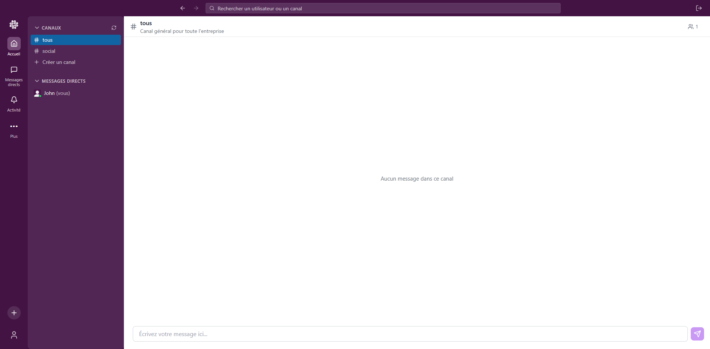

# Slack Clone

Une application de messagerie en temps réel inspirée de Slack, construite avec React (Vite), Node.js (NestJS) et MongoDB.

## 🚀 Démarrage rapide

> **Prérequis** :
> - Node.js 18+ ([Télécharger](https://nodejs.org/))
> - MongoDB ([Télécharger](https://www.mongodb.com/try/download/community) ou [Instructions d'installation](database/README.md))
> - npm ou yarn

### Lancement en mode développement

1. **Backend**
   ```bash
   cd backend
   npm install
   npm run start:dev     # Lance le serveur sur http://localhost:3000
   ```

2. **Frontend**
   ```bash
   cd frontend
   npm install
   npm run dev          # Lance l'application sur http://localhost:5173
   ```

Ces commandes utiliseront les configurations par défaut :
- Backend : `http://localhost:3000` avec MongoDB sur `mongodb://localhost:27017/slack`
- Frontend : `http://localhost:5173` connecté au backend par défaut

## ⚙️ Configuration détaillée

### Backend
- Port par défaut : `3000`
- Base de données : `mongodb://localhost:27017/slack`
- Variables d'environnement (optionnelles) :
  ```bash
  cd backend
  cp .env.example .env    # Configurez selon vos besoins
  ```
  Valeurs par défaut :
  - PORT=3000
  - DATABASE_URL=mongodb://localhost:27017/slack
  - JWT_SECRET=dev-secret-key
  - JWT_EXPIRES_IN=24h

### Frontend
- Port par défaut : `5173`
- Configuration du Backend : `src/config/api.ts`
  - `BASE_URL` par défaut : `http://localhost:3000`

### Installation MongoDB
Si MongoDB n'est pas installé sur votre machine, suivez les instructions dans le dossier [database/](database/README.md).
Vous pouvez utiliser Docker ou une installation locale.

## 📁 Structure du Projet

```
slack/
├── backend/    # API NestJS
├── frontend/   # Application React
└── database/   # Configuration MongoDB
└── docs/       # Fichiers nécessaires pour la documentation
```

## 📱 Utilisation de l'application

### 1. Création de compte


Pour créer un compte, remplissez le formulaire d'inscription avec :
- **Nom d'utilisateur** : Votre pseudo qui sera visible par les autres utilisateurs
- **Email** : Une adresse email valide (pas de vérification requise)
- **Mot de passe** : Minimum 6 caractères
- **Photo de profil** : Optionnelle, vous pourrez la modifier plus tard

> Note : Pour simplifier le développement, nous n'avons pas implémenté de vérification d'email afin d'éviter la configuration d'un serveur SMTP.

### 2. Connexion


Connectez-vous avec :
- **Email** : L'adresse email utilisée lors de l'inscription
- **Mot de passe** : Votre mot de passe

### 3. Dashboard


Une fois connecté, vous accédez au dashboard qui comprend :

**Navigation principale :**
- **Barre de recherche** : En haut, permet de rechercher des utilisateurs ou des canaux
- **Bouton de déconnexion** : Pour se déconnecter de l'application

**Barre latérale :**
- **Section CANAUX :**
  - Liste des canaux avec préfixe "#" (ex: #tous, #social)
  - Bouton Rafraichir pour rafraichir la liste des canaux
  - Indicateur du nombre de membres par canal
  - Canal "#tous" par défaut pour toute l'entreprise

- **Section MESSAGES DIRECTS :**
  - Liste des conversations privées
  - Statut des utilisateurs (en ligne, hors ligne)
  - Indication "(vous)" pour votre propre utilisateur

**Zone principale :**
- Zone de chat avec message d'accueil "Aucun message dans ce canal"
- Zone de saisie en bas pour envoyer des messages
- Description du canal en haut (ex: "Canal général pour toute l'entreprise")

### 4. Messages Directs


Les messages directs permettent des conversations privées entre utilisateurs :

**Fonctionnalités :**
- **Statut en ligne** : Indicateur vert "En ligne" quand l'utilisateur est connecté
- **Messages en temps réel** : Les messages apparaissent instantanément grâce à WebSocket, sans besoin de rafraîchir
- **Historique des messages** : Affichage chronologique avec horodatage (format 23:51)
- **Interface de chat** :
  - Zone de saisie en bas avec envoi par la touche Entrée ou le bouton d'envoi
  - Messages affichés avec l'avatar et le nom de l'expéditeur
  - Indication de la date des messages (ex: "Dimanche 9 Février")